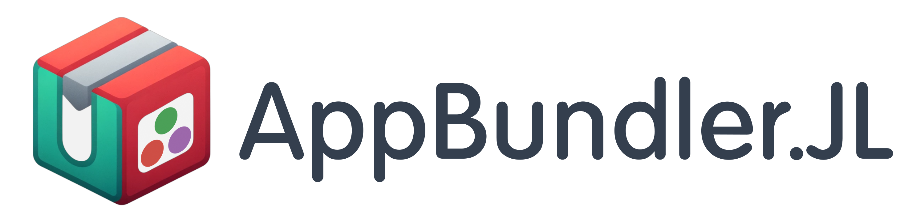

# AppBundler.jl





`AppBundler.jl` offers recipes for building Julia GUI applications in modern desktop application installer formats. It uses Snap for Linux, MSIX for Windows, and DMG for MacOS as targets. It bundles full Julia within the app, which, together with artifact caching stored in scratch space, allows the bundling to be done quickly, significantly shortening the feedback loop.

The product build of `AppBundler.jl` for macOS and Windows is a bundle that can be conveniently finalised with a shell script on the corresponding host system without an internet connection. This allows us to avoid maintaining multiple Julia installations for different hosts and reduces failures due to a misconfigured system state. It is ideal for a Virtualbox setup where the bundle is sent over SSH and bundling script, after which the finalised installer is retrieved. 

Creating a single project file for bundling is impractical as the configuration options for each installer bundle vary greatly and are virtually limitless. This is where the AppBundler recipe system comes into the picture. AppBunlder provides default configuration files which substitute a few set variables specified at the `Project.toml` in a dedicated `[bundle]` section. This shall cover plenty of use cases, but as application development progresses, the application may need a web camera, speaker, network server, etc, which need to be explicitly allowed in `snap.yaml`, `AppxManifest.xml` and `Entitlements.plist` files. For those situations, the user puts an overloading recipe file in the `meta` folder. Additional files can be provided easily for the bundle by placing them in a corresponding folder hierarchy. For instance, this can be useful for providing custom-sized icon sizes. To see how that works, see the [AppBundler.jl/examples](https://github.com/PeaceFounder/AppBundler.jl/tree/main/examples) folder and the [PeaceFounderClient](https://github.com/PeaceFounder/PeaceFounderClient/releases/tag/v0.0.2), where for the latter, see the releases page to see what one can expect. 

All recipes define a `USER_DATA` environment variable where apps can store their data. On Linux and Widnws those are designated application locations which get removed with the uninstallation of the app, whereas on MacOS, apps use `~/.config/myapp` and `~/.cache/myapp` folders unless one manages to get an app running from a sandbox in which case the `$HOME/Library/Application Support/Local` folder will be used. 

Thought has also been put into making the precompilation experience better. For MacOS, precompilation can be done before bundling in the `/Applications` folder by running `MyApp.app/Contents/MacOS/precompile`. For Linux, precompilation is hooked into the snap configure hook executed after installation. For Windows, a splash screen is shown during the first run, providing user feedback that something is happening. Hopefully, the cache relocability fix in Julia 1.11 will allow us to precompile the Windows bundle as well.

## Usage

AppBundler expects an application folder which contains `main.jl`, `Project.toml` and `Manifest.toml`. The application entry point is the `main.jl,` which allows starting the application with `julia --project=. main.jl` from the project directory. A `Project.toml` contains many adjustable template variables under a `[bundle]` section. The configuration of the `bundle` sits in a `meta` folder from where files take precedence over the AppBunlder `recepies` folder. Thus, it is straightforward to copy a template from the recipies folder, modify and place it in the `meta` folder if the default configuration does not suffice. See the `examples` folder to see ways to configure. 

A bundle can be created with `AppBundler.bundle_app` function as follows:

```julia
import AppBundler
import Pkg.BinaryPlatforms: Linux, MacOS, Windows
bundle_app(MacOS(:x86_64), APP_DIR, "$BUILD_DIR/gtkapp-x64.app")
```

The first argument is a platform for which the bundle is being made; in this case, MacOS; the second `APP_DIR` is the location for the project, and `BUILD_DIR` is the location where the bundles will be stored. For Linux, the extension `.snap` and Windows `.zip` for destination determines whether the output is compressed, which can be overridden by `compress=false` in the keyword arguments. 

The resulting bundles can be easily tested on the resulting platforms. The testing phase works without any postprocessing as follows:

- **MacOS:** Double-click on the resulting app bundle to open the application. 
- **Linux:** the snap can be installed from a command line `snap install --classic --dangerous app.snap`
- **Windows:** the bundle can be tried from the application directory with the PowerShell command  `Add-AppPackage -register AppxManifest.xml`

Note that you will face difficulties when using `AppBundler` from Windows for Linux, macOS and other UNIX operating systems, as Windows does not have a concept of execution bit. By hand, you could set `chmod +x` to every executable on the resulting platform. Technically, this can be resolved by directly bundling files into a tar archive and processing the incoming archives without extraction, but this will not happen. Thus, it is better to use WSL when bundling for other platforms on Windows.

## Post Processing

After the bundle is created, it needs to be finalised on the host system, where precompilation and, usually, bundle signing must be performed.

### MacOS

1. Precompilation can be done `myapp.app/Contents/MacOS/precompile`, which will generate a compilation cache in `myapp.app/Contents/Frameworks/compiled` folder. As a hack, precompilation can be done from the `/Applications/MyApp` folder so that users would not need to wait for precompilation when starting the app (untested).
2. Before an application can be signed, we need to create an executable which can store signatures in metadata. Rename the bash launcher script as `MacOS/main` and compile `Resources/launcher.c` using `gcc` and move the executable to the launcher location `MacOS/myapp`. The executable will start `MacOS/main; thus, little can go wrong there.
3. Code signing can be performed with `codesign`. `Resources/Entitlements.plist` file contains entitlements which should be used when signing the final bundle.
4. For the creation of a dmg bundle, the `dmgbuild` is recommended, which can be installed conveniently with `pip install dmgbuild`. For convenience, `Resources/dmg_settings.py` is provided, which allows to `dmgbuild -s "MyApp/Contents/Resources/dmg_settings.py" -D app="MyApp" "MyApp Installer" "MyApp.dmg"`

### Linux

1. If the application is compressed into the snap, use `unsquashfs myapp.snap`
2. Run precompilation with `myapp/bin/precompile,` which will create `myapp/lib/compiled` 
3. Squash the folder back into a snap with the command `mksquashfs myapp myapp.snap -noappend -comp xz`

For snap, it is also worth mentioning the `snap try myapp` command, which allows one to install an application without squashing. There is also `snap run --shell myapp`, which is a valuable command for entering into the snap confinement shell. 

### Windows

For Windows, one has to install `makappx`, `signtool`, and `editbin` installed with WindowsSDK. Installation of Windows SDK fails. Thus, one needs to install Visual Studio Code, adding a few more gigabytes to download and install. For those who run Windows from Parallels, don't run the `Add-Package -register AppxManifest.xml` from a network drive, but copy the files to the home directory instead, as otherwise, Julia crashes. Also, running an executable from installation location `C:\ProgramFiles\WindowsApps\<app folder>` with admin privileges will run the application within the containerised environment specified with `AppxManifest.xml`. 

**Generation of Self-Signing Certificate**

It must be signed to test and install the `.msix` bundle on the Windows S platform. We can do that with self-signing, where the certificate is added to the system's store. An alternative is to exit from `Windows S` and enable side loading under developer tools, which is only available after buying the Windows license. The procedure here should be easily adaptable with a codesigning certificate from a trusted provider. 

A self-signing certificate can be made from a PowerShell with the following command:

```powershell
New-SelfSignedCertificate -Type CodeSigningCert -Subject "CN=YourName" -KeyAlgorithm RSA -KeyLength 2048 -CertStoreLocation "Cert:\CurrentUser\My" -FriendlyName "YourCertificateName"
```

The critical part is `CN=YourName`, which must match the `Publisher` entry in `AppxManifest.xml` for the package to be correctly signed.  The output generates a thumbprint for the certificate, which you place in the following command, which will create your private key signed with the certificate:

```
Export-PfxCertificate -cert "Cert:\CurrentUser\My\[Thumbprint]" -FilePath JanisErdmanis.pfx -Password (ConvertTo-SecureString -String "YourPassword" -Force -AsPlainText)
```

which generates a pfx certificate and adds password protection. 

**Bundling Procedure for MSIX**

After installation of Visual Studio Code, find the relevant tools (best to do that with Windows Finder) and either add them to a path or make an alias like:

```powershell
New-Alias -Name makeappx -Value "C:\Program Files (x86)\Windows Kits\10\bin\10.0.22621.0\x64\makeappx.exe"
New-Alias -Name signtool -Value "C:\Program Files (x86)\Windows Kits\10\bin\10.0.22621.0\x64\signtool.exe"
New-Alias -Name editbin -Value "C:\Program Files\Microsoft Visual Studio\2022\Community\VC\Tools\MSVC\14.37.32822\bin\Hostx64\x64\editbin.exe"
```

1. If the bundle is compressed, unzip it.
2. Run the precompilation script `myapp\precompile.ps1` which will generate `myapp\compiled` 
3. Set `julia.exe` to be Windows application `editbin /SUBSYSTEM:WINDOWS myapp\julia\bin\julia.exe` so the console is not shown when the app is run.
4. Make a bundle `makeappx pack /d myapp /p myapp.msix`
5. Sign the bundle `signtool sign /fd SHA256 /a /f JanisErdmanis.pfx /p "PASSWORD" myapp.msix`

When self-signed, the resulting bundle can not immediately be installed as the certificate is not binding to the trusted anchors of the system. This can be resolved by installing the certificate to the system from the MSIX package itself, which is described in https://www.advancedinstaller.com/install-test-certificate-from-msix.html
