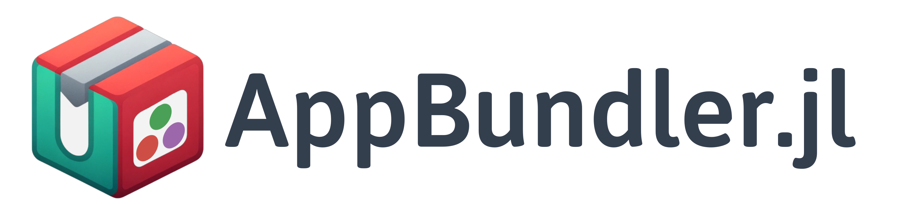

# AppBundler.jl

[](https://peacefounder.org/AppBundler.jl/)
[](https://codecov.io/gh/PeaceFounder/AppBundler.jl)



AppBundler.jl is a Julia package for building native installers — Snap, MSIX, and DMG — using open-source tools available across all UNIX platforms (Linux, macOS, FreeBSD), while also being able to build MSIX on Windows itself. It replaces host system packaging utilities with cross-compiled tools distributed through Julia's Yggdrasil registry, resulting in a consistent and reproducible pipeline with no per-platform build environments required.

The package provides a clean API for bundling any Julia application exposing `@main`, with support for icons, configuration files, and native customization. GitHub Actions workflows allow multi-platform installer builds to be triggered with a single click, making continuous delivery of native installers practical for open-source Julia projects. AppBundler can also bundle applications written in other build systems (see docs).

📖 **[Read the full documentation](https://peacefounder.org/AppBundler.jl/)**

## Showcase

The following videos demonstrate the DMG and MSIX installers produced via AppBundler.

| [](https://www.youtube.com/watch?v=x-3RUXw15tc) | [](https://www.youtube.com/watch?v=cjGV5itF4TE&t=144s) |
|:---:|:---:|
| DMG | MSIX |

> **Note:** The bundling API has evolved and since MSIX video were recorded, but the pipeline structure and the resulting installer looks just the same.

## Quickstart

If your Julia application exposes `@main` and can be launched with `julia --project=. -m MyApp`, it's ready to bundle. Here's how to get from source to a native installer in a few steps.

### 1. Install AppBundler

```
]app add AppBundler
```

Make sure `~/.julia/bin` is on your `PATH` after installation.

### 2. Build your installer

From your project directory, run:

```
appbundler build . --build-dir=build --selfsign
```

This detects your current platform and builds the appropriate installer — no extra configuration needed to get started.

### 3. Find your installer

Your installer will be in the `build/` directory, ready to distribute. AppBundler detects your current platform and produces the corresponding installer:

- `build/MyApp.msix` on Windows
- `build/MyApp.snap` on Linux
- `build/MyApp.dmg` on macOS

To build for all three platforms at once, check out the included GitHub Actions workflow templates — they run each platform's build in parallel with a single push.

## Compilation & Customization

AppBundler offers a lot of room to grow as your project matures:

- **Package images** — faster startup via precompiled pkgimages
- **Sysimage** — even faster startup with a bundled system image
- **JuliaC** — native compilation (including the new `--trim` feature) for smaller installers
- **Sandboxing, terminal visibility, icons, and more** — full control over how your app looks and behaves on each platform

AppBundler can also bundle applications written in other build systems, and can build full Julia distributions — as demonstrated by [Jumbo Julia](https://github.com/JanisErdmanis/Jumbo).

➡️ See the **[full documentation](https://peacefounder.org/AppBundler.jl/)** for all options and platform-specific configuration.

## Supported GUI Frameworks

These frameworks have been tested with AppBundler. Minimal example applications for each are available in the [examples folder](https://github.com/PeaceFounder/AppBundler.jl/tree/main/examples) — copy them straight from `pkgdir(AppBundler)` once installed.

| Framework | Platform Support | Notes | Examples |
|-----------|-----------------|-------|----------|
| QML | ✓ All platforms | Fully supported | [PeaceFounderClient](https://github.com/PeaceFounder/PeaceFounderClient/releases) |
| GLFW | ✓ All platforms | Fully supported | — |
| Electron | ✓ All platforms | Fully supported | [BonitoBook](https://github.com/SimonDanisch/BonitoBook.jl/pull/34) |
| Gtk/Mousetrap | ⚠ macOS, Linux | Does not launch on Windows | — |
| Makie | ⚠ All platforms | [GLMakie may not work on Windows](https://github.com/MakieOrg/Makie.jl/issues/5342) | [ImageColorThresholderApp](https://github.com/rakeshksr/ImageColorThresholderApp.jl/pull/4) |
| Blink | ⚠ All platforms | Requires heavy patching for relocatability | [KomaMRI](https://github.com/JuliaHealth/KomaMRI.jl/pull/640) |

## Installing Built Applications

*Sharing your app with end users? Here's what they need to know.*

- **MSIX (Windows):** For self-signed builds, open the MSIX properties and add the certificate to Trusted Root Certification Authorities first ([step-by-step guide](https://www.advancedinstaller.com/install-test-certificate-from-msix.html)). Then double-click the installer.
- **Snap (Linux):** Install from the terminal: `snap install --classic --dangerous MyApp.snap`
- **DMG (macOS):** For self-signed builds, click the app, then go to **Settings → Privacy & Security** to approve the launch request. Drag it to **Applications**, launch it, and approve once more in Privacy & Security if prompted.

These extra steps are only needed for self-signed builds. Purchasing Windows and macOS code signing certificates eliminates them entirely. For Snap, submitting to the Snap Store enables one-click GUI installation.

## Acknowledgments

This work is supported by the European Union through the Next Generation Internet initiative ([NGI0 Entrust](https://ngi.eu/ngi-projects/ngi-zero-entrust/)), via the NLnet [Julia-AppBundler](https://nlnet.nl/project/Julia-AppBundler/) project.
