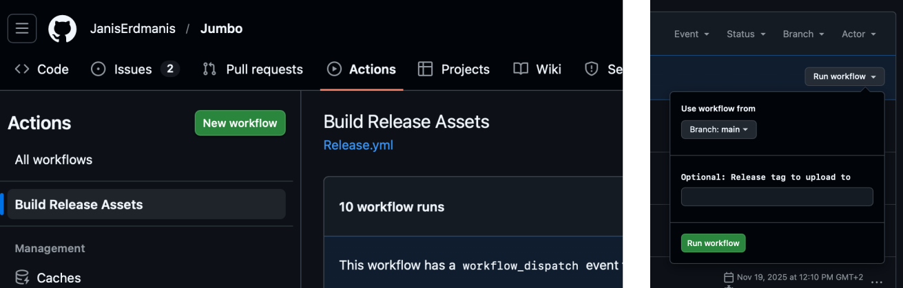
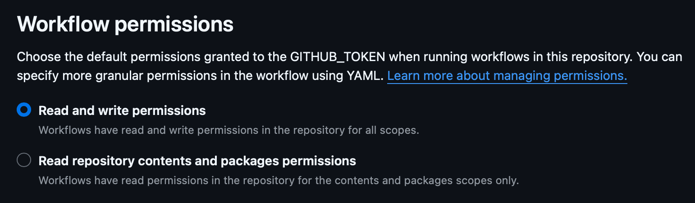

# Deployment

The deployment consists of compiling the application and distributing codesigned binaries that users can install. Although AppBundler offers cross compilaed tooling compilation of Julia does not support crss compilation and hence needs to be done on the host system operating ssytem and arhitecutre. That can become a significant burned for indie developers and hence CI worklwos comes at play to save us.

Currently, Julia does not cross-compile, except for macOS where `:aarch64` can also run `:x86_64` applications. Hence, one needs to have the host as a target, which nowadays can be easy to get via continuous integration infrastructure like GitHub, GitLab, etc. The bundling, however, is cross-platform compatible, where UNIX hosts can generate all compatible installers, which may be relevant for other programming language projects. 

## Codesiging

The DMG and MSIX bundles need to be codesigned for them to be installed. Selfsigning is an option however the users needs to jump through the hoops to install the applications. To avoid that the producer needs to geta code signing certificates. For DMG's it means to enroll into Apple developer program wheras for MSIX it means to buy one of the available codesigning certificates it can be Azure codesigning or [CERTUM](https://shop.certum.eu/code-signing.html) which offers best deal for codesigning of open source projects that I have found so far. 

AppBundler implements codesigning with provider issued certifiacte in `.pfx` format which is placed in `meta/dmg/certificate.pfx` and `meta/msix/certificate.pfx` accordingly. To test the deployment setup before comitting buying one we shall use a self signing certtificates as substitute that can be generated running from application directory:
```
AppBundler.generate_signing_certificates()
```
This will show two passwords on the screen `MACOS_PFX_PASSWORD` and `WINDOWS_PFX_PASSWORD`. 

To sign an application the password can be passed in as standart input which get asked automatically or alternativelly set as command line argument `--password` like:
```
appbundler build . --build-dir=build --password="{{MACOS_PFX_PASSWORD}}"
```

It expected that MSIX codesigning with trusted prover issued certificate shall work with no issues. A difficulet part though may be getting the `.pfx` certificate as some provioders puts the codesigning within some secure hardware tokens. Integration with them is planed in the future though it is currently speculative on how the API could look like. For custom signing solutions currently users are advised to use lower level api as as shown in the [reference](reference.md). 

MacOS codesigning happens to be a more cursed than simply signing the with the certificate in that it needs to be notarized by the apple where you send the bundle to the apple who checks whether it is properly formed and does not contain malware or such. Two of the requirements need to be enabled that can be specified via `LocalPreferences.toml`:
```
dmg_shallow_signing = false
dmg_hardened_runtime = true
```
Note that the shallow signing is enabled becauwse deep signing for Julia applications takes noticable time. Furthermrore deep signing as implemented `rcodesign` does fail for Julia projects and hence artifact signing needs to be performed manually. Unfortunatelly there is no way to verify whether deep signing is performed correctly as `codesign --verify --deep --verbose=4 myapp.app` with shallow signing suceeds appart from sending bundles to Apple notary to see what their repply is. Hence DMG codesigning needs more investigation which the first time users need to account for.

## GitHub Workflow



GitHub is convineint place to cross compile applications as it offers runners accross all platofrms including Windows, MacOS and Linxu with all available arhitectrures. This enables to go through actions tab and on a press of button compile application accross all platofrsms as well as attach thoose artifacts to compile and attach them to new releases. For an example see [Release.yml](https://github.com/JanisErdmanis/Jumbo/blob/main/.github/workflows/Release.yml) which shall be placed within `.github/workflows/Release.yml` folder where GitHub picks it up. This action file can also be installed in the application project via running `AppBundler.install_github_workflow()`.To make the action to work it is necessary to increase permissions for GitHub actions:



## Gitlab Workflow

Gitlab offers only linux runners, hence it is not really suitable for Julia application deployment. Some deployments may offer macxos and windows rnnners as extra service. The GiLab CI that offers similar deployment experience as Giuthub is available in [crypto-julia example repository](https://gitlab.com/JanisErdmanis/crypto-julia/-/blob/main/.gitlab-ci.yml?ref_type=heads).
