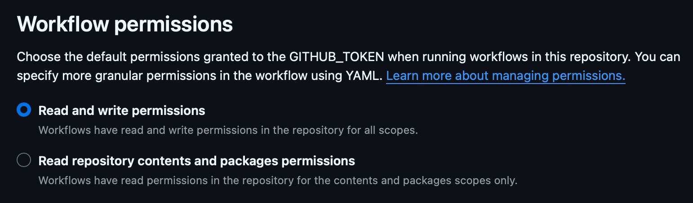

# Deployment

Deploying an application involves compiling it for each target platform and distributing codesigned binaries that users can install. AppBundler supports cross-platform *bundling* — meaning a UNIX host can produce installers for multiple platforms — but Julia itself does not support cross-compilation. As a result, compilation must be performed natively on each target OS and architecture. This can be a significant burden for indie developers, which is where CI workflows become essential.

The one exception is macOS: because Apple Silicon Macs support Rosetta 2, an `:aarch64` host can run `:x86_64` binaries, so both architectures can be tested on a single machine. For all other platforms, you need a matching host, which is straightforward to obtain through GitHub Actions or similar CI infrastructure.

## Code Signing

Both DMG (macOS) and MSIX (Windows) bundles must be codesigned before users can install them. Self-signed certificates are possible but require users to manually trust the certificate, which creates friction. To distribute without that friction, you need a certificate from a trusted provider.

- **macOS:** Requires enrollment in the [Apple Developer Program](https://developer.apple.com/programs/).
- **Windows:** Requires a commercial codesigning certificate. [CERTUM](https://shop.certum.eu/code-signing.html) currently offers the best value for open-source projects.

AppBundler expects provider-issued certificates in `.pfx` format, placed at:

```
meta/dmg/certificate.pfx   # macOS
meta/msix/certificate.pfx  # Windows
```

### Testing with Self-Signed Certificates

Before purchasing a certificate, you can generate self-signed certificates to test the full signing workflow:

```julia
AppBundler.generate_signing_certificates()
```

This prints two passwords to the terminal: `MACOS_PFX_PASSWORD` and `WINDOWS_PFX_PASSWORD`. You can then pass the password when building:

```
appbundler build . --build-dir=build --password="{{MACOS_PFX_PASSWORD}}"
```

Alternatively, omitting `--password` will prompt for it interactively.

## GitHub Actions Workflow

GitHub Actions is the recommended CI solution for cross-platform Julia application deployment. It provides hosted runners for Windows, macOS, and Linux across all common architectures, making it straightforward to build and sign for every platform from a single workflow.

An example workflow is available at [Release.yml](https://github.com/JanisErdmanis/Jumbo/blob/main/.github/workflows/Release.yml). It can be installed into your project automatically by running:

```julia
AppBundler.install_github_workflow()
```

This places the workflow file at `.github/workflows/Release.yml`, where GitHub picks it up. The workflow can be triggered manually from the Actions tab and will compile the application for all platforms, then attach the resulting installers to a new GitHub Release.

One configuration step is required: you must increase the default permissions granted to GitHub Actions so that the workflow can create releases and upload artifacts. This setting is found under **Settings → Actions → General → Workflow permissions** in your repository.



## GitLab CI Workflow

GitLab's shared runners are Linux-only, which limits its usefulness for Julia application deployment — macOS and Windows runners are available only as a paid add-on from some GitLab instances. If your project is already hosted on GitLab, a CI configuration that provides a similar deployment experience to the GitHub workflow above is available in the [crypto-julia example repository](https://gitlab.com/JanisErdmanis/crypto-julia/-/blob/main/.gitlab-ci.yml?ref_type=heads).

