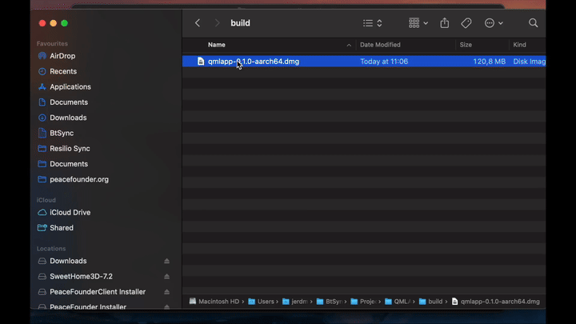

# DMG

DMG is the standard disk image format for distributing macOS applications. AppBundler builds `.dmg` images with a fully open-source toolchain, so they can be created and signed on any platform without Xcode.



## Build pipeline

The standard Apple workflow signs the app bundle with `codesign`, packs it into a disk image with `hdiutil`, signs the image, submits it for notarization with `notarytool`, and attaches the notarization ticket with `stapler`:

```
MyApp.app → codesign → hdiutil → codesign → notarytool → stapler
```

These tools are available only on macOS. AppBundler uses open-source equivalents instead:

```
MyApp.app → rcodesign → xorriso → dmg → rcodesign notarize
```

Here `dmg` comes from [libdmg-hfsplus](https://github.com/planetbeing/libdmg-hfsplus), and `rcodesign` handles both code signing and notarization. All tools are redistributable and cross-compiled with [BinaryBuilder](https://github.com/JuliaPackaging/BinaryBuilder.jl), so DMG images can be built and signed from Linux and Windows as well as macOS.

## Package contents

Before creating the image, AppBundler assembles the `MyApp.app` bundle with the following layout:

| Path | Purpose |
|------|---------|
| `Contents/MacOS/MyApp` | Application launcher |
| `Contents/Libraries/main` | Binary stub reference |
| `Contents/Info.plist` | Application metadata |
| `Contents/Resources/icon.icns` | Application icon |
| `../DS_Store` | Controls the installer's appearance |

Sandboxing and permissions are configured through `Entitlements.plist`, which is embedded in the launcher's signature during code signing.

!!! warning "Native launcher required"
    The launcher must be a native binary, since macOS code signing and entitlements cannot be applied to scripts.

## Code signing

Apple issues code signing certificates only to members of the Apple Developer Program, which costs €99/year as of September 2026. Distribution outside the Mac App Store requires a **Developer ID Application** certificate, and only the account holder can create one. A standalone `certificate.pfx` can be produced on any platform with OpenSSL:

1. Generate a private key and a certificate signing request:

```sh
   openssl genrsa -out developer_id.key 2048
   openssl req -new -key developer_id.key -out developer_id.csr \
       -subj "/emailAddress=you@example.com/CN=Your Name/C=LV"
```

2. In the [Apple Developer portal](https://developer.apple.com/account/resources/certificates/list), create a new **Developer ID Application** certificate, upload `developer_id.csr`, and download the resulting `.cer` file.

3. Combine the certificate and key into a password-protected `.pfx`:

```sh
   openssl x509 -inform DER -in developerID_application.cer -out developer_id.pem
   openssl pkcs12 -export -inkey developer_id.key -in developer_id.pem -out dmg/certificate.pfx
```

Notarization additionally requires an App Store Connect API key, created in [App Store Connect](https://appstoreconnect.apple.com/access/integrations/api) under Users and Access → Integrations.

### Notarization

macOS codesigning has an additional requirement beyond certificate signing: Apple requires all distributed applications to be *notarized*. Notarization means submitting the bundle to Apple's servers, where it is checked for proper structure and the absence of malware. Two settings must be enabled in `LocalPreferences.toml` for a bundle to pass notarization:

```toml
dmg.shallow_signing = false
dmg.hardened_runtime = true
```

> **Note on shallow vs. deep signing:** Deep signing is disabled by default because it takes considerable time for Julia applications and currently tends to fail with `rcodesign` deep signing. Unfortunately, `codesign --verify --deep --verbose=4 myapp.app` passes even with shallow signing, so the only reliable way to verify that deep signing is correct is to submit the bundle to Apple's notary service and inspect the response. Budget some time for this when setting up notarization for the first time.

### Self-signing

For testing, AppBundler can generate a self-signed certificate at `dmg/certificate.pfx`:

```julia
AppBundler.install_dmg_certificate("dmg/certificate.pfx")
```

The generated password is printed to stdout. Pass it to the build with `--password=mypassword`. For a quick local build, use `--selfsign` instead: it signs with a throwaway certificate and ignores `dmg/certificate.pfx`.

Apple notarizes only packages signed with a Developer ID certificate, so self-signed builds cannot be notarized. Gatekeeper blocks them by default, and they must be installed as described below.

## Installing self-signed packages

Gatekeeper blocks applications that are not signed with a Developer ID certificate and notarized. Users must explicitly allow them, as described in Apple's guide to [opening apps from an unknown developer](https://support.apple.com/guide/mac-help/open-a-mac-app-from-an-unknown-developer-mh40616/mac). To automate this, AppBundler provides `recipes/dmg/bootstrap.sh`. It mounts the DMG, copies the app to `/Applications`, and removes the quarantine attribute:

```sh
bootstrap.sh myapp.dmg
```

This also enables one-line web installs: a hosted `install.sh` can download the DMG and `bootstrap.sh` and run `bootstrap.sh myapp.dmg`, invoked with e.g.:

```sh
curl -fsSL https://example.com/install.sh | sh
```

## API

```julia
dmg_config = DMG(project; selfsign = true)

bundle(dmg_config, dmg_archive) do app_stage
    # install files into app_stage
end
```

```@docs
AppBundler.DMG
```
