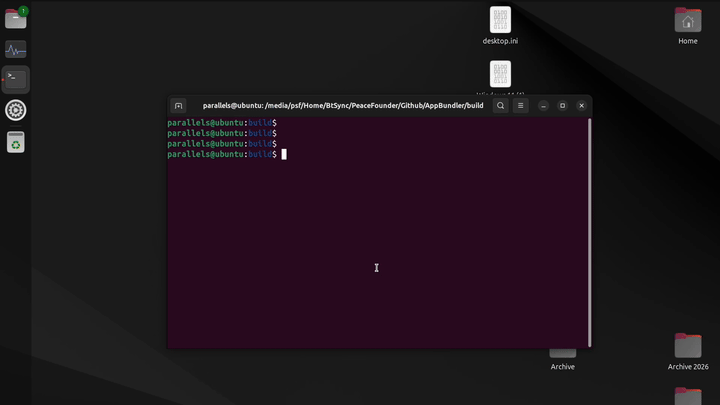

# Snap

Snap is a sandboxed application package format for Linux, supported across most major distributions. AppBundler builds `.snap` packages with a fully open-source toolchain, so they can be created on any platform without a Linux build environment.



## Build pipeline

The standard workflow describes the build in `snapcraft.yaml` and lets `snapcraft` fetch sources, compile, and package the application:

```
snapcraft.yaml → snapcraft → MyApp.snap
```

`snapcraft` is open source, but it expects to run the compilation itself and does not cross-compile. Since a snap is ultimately a SquashFS image with metadata, AppBundler assembles the staging directory itself and compresses it directly:

```
StagingDir → mksquashfs → MyApp.snap
```

`mksquashfs` comes from [squashfs-tools](https://github.com/plougher/squashfs-tools). It is redistributable and cross-compiled with [BinaryBuilder](https://github.com/JuliaPackaging/BinaryBuilder.jl), so snaps can be built from macOS and Windows as well as Linux.

## Package contents

Before compressing, AppBundler assembles `StagingDir/` with the following layout:

| Path | Purpose |
|------|---------|
| `meta/snap.yaml` | Package metadata and configuration |
| `bin/MyApp` | Application launcher |
| `meta/icon.png` | Application icon |
| `meta/gui/MyApp.desktop` | Desktop integration |
| `meta/hooks/configure` | Configuration hook |

Sandboxing and permissions are configured through the confinement level and the interfaces (plugs) declared in `meta/snap.yaml`.

## Signing and installation

A locally built snap therefore has no assertions and must be installed with `--dangerous`. AppBundler applications usually use classic confinement, which also requires `--classic`:

```sh
sudo snap install --classic --dangerous myapp.snap
```

If the application is configured for strict confinement in `meta/snap.yaml`, drop `--classic`. Snaps installed this way get a local revision such as `x1` and receive no automatic updates.

### SnapStore

Once a snap is published, the store-signed version can be installed offline, for example on air-gapped machines. Download the snap together with its assertions, then import the assertions before installing:

```sh
snap download myapp             # fetches myapp_N.snap and myapp_N.assert
sudo snap ack myapp_N.assert
sudo snap install myapp_N.snap
```

Snaps preseeded into Ubuntu Core or custom images with `ubuntu-image` also carry their assertions and install without extra flags.

## Debugging

To debug Snap packages, skip compression and install the staging directory directly. You can also inspect the sandbox environment of the installed application:

```sh
sudo snap try myapp_dir     # install unpackaged directory
snap run --shell myapp      # inspect sandbox environment interactively
```

## API

```julia
snap_config = Snap(project)

bundle(snap_config, snap_archive) do app_stage
    # install files into app_stage
end
```

```@docs
AppBundler.Snap
```
